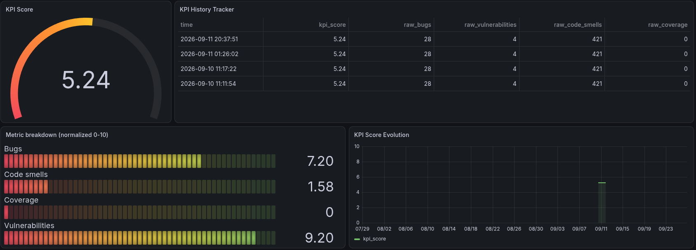
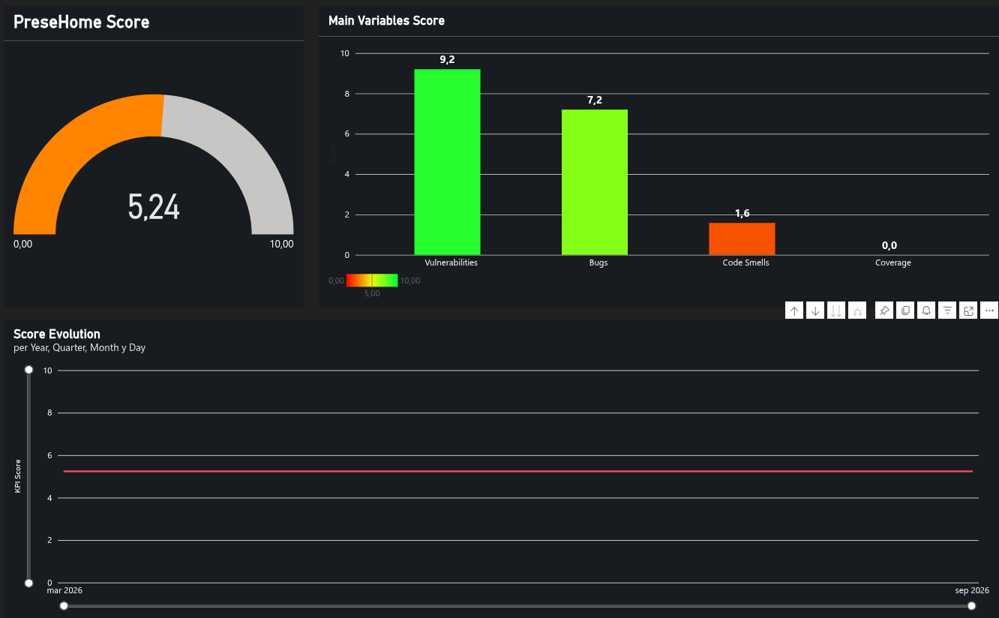

# PreseHome - KPIs

A lightweight Engineering Metrics Platform that extracts code quality data from SonarCloud, transforms it into actionable KPIs, and feeds both engineering dashboards in Grafana and executive reporting in Microsoft Power BI.

The project demonstrates how engineering metrics pipelines can support technical governance and data-driven decision making in software organizations.

## Engineering Metrics Pipeline

This project implements a lightweight engineering metrics pipeline designed to monitor the technical health of a software product and provide actionable insights for both engineering teams and management.

The pipeline follows a typical data engineering flow:

1. Metric extraction

    The system collects code quality metrics from SonarCloud through its API.

2. KPI calculation

    Raw metrics are processed using Python scripts to generate higher-level indicators such as:
- Code Quality Score
- Technical Debt Ratio
- Application Health Index

3. Dataset generation

    The processed metrics are exported into structured datasets that can be consumed by visualization and reporting tools.

4. Dashboard integration

    The datasets feed two different visualization layers:
- Technical observability dashboards in Grafana
- Executive reporting dashboards in Microsoft Power BI

    This architecture simulates how many organizations implement engineering metrics platforms to monitor software quality and support data-driven decision making.


Automation is implemented via GitHub Actions (`.github/workflows/main.yml`, issues #41/#42): the pipeline runs daily on a schedule (plus on-demand via a manual trigger), and its output — `data/raw/`, `data/processed/`, `datasets/kpi_history.json` — is committed back to the repo automatically after each run. Running the pipeline manually, as described under "Enviroment installation" below, is for local development and testing.

## Technical vs Executive Dashboards

The project intentionally separates technical monitoring from executive reporting, as these audiences require different levels of information. Both dashboards below are implemented (issues #37 and #38) — see "Dashboards" for screenshots and exported/source files.

### Grafana — Technical Engineering Observability

Dashboards in Grafana focus on low-level engineering metrics used by developers and DevOps teams.

- Typical metrics include:
- Code coverage
- Bugs detected
- Vulnerabilities
- Code smells
- Technical debt
- Historical trends of code quality metrics

These dashboards allow engineers to monitor the technical state of the codebase and quickly identify quality issues.

### Power BI — Executive KPI Reporting

Dashboards in Microsoft Power BI provide aggregated indicators designed for management, PMO, or product leadership.

Rather than raw metrics, the report is built around the pipeline's single weighted `kpi_score` (0–10), broken down by its four weighted components (bugs, vulnerabilities, code smells, coverage) and its trend over time. See `docs/powerbi/dax_measures.md` for the full DAX model behind it — the report was built entirely in Power BI Service's browser-based editor (no Power BI Desktop, since this project is developed on Linux and Desktop is Windows-only).

These dashboards help stakeholders understand the overall health of the application and support strategic decisions.

### Keeping the Power BI Report Up to Date

The Power BI report refreshes automatically (issue #43) — no manual steps required. Its data source is Power BI Service's Web connector, pointed at this repo's `datasets/kpi_history.json` via the GitHub REST API:

```
https://api.github.com/repos/antoniorr02/PreseHome-KPIs/contents/datasets/kpi_history.json?ref=main
```

authenticated with a GitHub Personal Access Token passed as an `Authorization` header credential (plus an `Accept: application/vnd.github.raw+json` header, so the API returns raw file content instead of a base64-wrapped JSON envelope).

This closes the loop with US06's automation: the GitHub Actions workflow (`.github/workflows/main.yml`, issues #41/#42) runs the pipeline on a schedule and commits the updated `datasets/kpi_history.json` back to `main`; Power BI Service's own scheduled refresh then picks up that change on its own schedule. Neither side has to trigger the other manually.

The one-time manual upload process this replaced (issue #38's original setup — export to CSV, upload, replace) is retired. `src/utils/powerbi/export_history_csv.py` is no longer needed to keep the report current, but is kept as a small utility for local testing (flattening `kpi_history.json` to CSV without needing to wait for a GitHub Actions run).

## Dashboards

<!-- Add screenshots to docs/screenshots/ with the filenames below — see docs/screenshots/README.md -->

### Grafana



*Source: `dashboards/grafana/code_quality_dashboard.json` (exported dashboard JSON, importable directly into Grafana).*

### Power BI



*Source: `dashboards/powerbi/Executive Report - PreseHome.pbix`. DAX measures documented in `docs/powerbi/dax_measures.md`.*

## Architecture

Separating technical metrics from executive KPIs reflects a common practice in engineering organizations:

- Operational dashboards for engineering teams
- Business intelligence dashboards for leadership and governance

This dual-layer reporting model helps ensure that both technical and business stakeholders can access the information relevant to their decision-making process.

    +------------------+
    | GitHub Actions   |
    | (daily cron +    |
    |  on-demand)      |
    +--------+---------+
             |
             | triggers
             v
                 +------------------+
                 |    SonarCloud    |
                 +---------+--------+
                           |
                           v
                +--------------------+
                |  Extraction Layer  |
                |   (Python scripts) |
                +---------+----------+
                          |
                          v
                +--------------------+
                |  KPI Engine        |
                |  (Processing)      |
                +---------+----------+
                          |
                          v
                +--------------------+
                |  Dataset Layer     |
                +---------+----------+
                          |
               +----------+----------+
               |                     |
               v                     v
         +-----------+         +-----------+
         | InfluxDB  |         |  GitHub   |
         |  (Cloud)  |         |  (JSON)   |
         +-----+-----+         +-----+-----+
               |                     |
               v               +-----+-----+
          +---------+          |           |
          | Grafana |          v           v
          | (Tech   |    +----------+ +-----------+
          |Dashboard)|   |  Backup  | |  Power BI |
          +---------+    | /Migrate | | (Executive|
                          +----------+ | Dashboard)|
                                       +-----------+

GitHub Actions also performs the final commit into the `GitHub (JSON)`
box (issues #41/#42) — the same workflow both triggers the pipeline
and pushes its output back to the repo.

**Note on OneDrive:** it's deliberately not in the diagram above — `src/utils/onedrive/` (issue #28) is a fully built, working upload integration, but it's a **standalone utility, not called by the pipeline**. Power BI reads from the `GitHub (JSON)` box directly instead (issue #43), which is why OneDrive isn't part of the live data flow. Kept available for manual use — see `CLAUDE.md`'s "Utilities" section for how to run it.

## Repository Structure

src/
    extraction/      # metric collection
    processing/      # KPI calculations
    export/          # dataset generation
    utils/
        onedrive/    # standalone OneDrive upload utility (not wired into the pipeline)
        powerbi/     # flattens kpi_history.json to CSV for manual Power BI re-upload

data/
    raw/             # raw metrics from APIs
    processed/       # processed KPI data

datasets/
    engineering_metrics.json

dashboards/
    grafana/         # technical observability (exported dashboard JSON)
    powerbi/         # executive reporting (.pbix + theme)

docs/
    powerbi/         # DAX measures reference for the executive report
    screenshots/      # dashboard screenshots shown in this README

## Enviroment installation for Linux

```bash
python -m venv venv
source venv/bin/activate
pip install -r requirements.txt
pip install -e .
```

For extract metrics from SonarCloud:

```bash
python src/extraction/extract_sonar.py
```

For calculate KPIs:
```bash
python src/processing/calculate_kpis.py
```

## Definition of Done

A user story is considered completed when:

- The corresponding operational tasks are implemented
- The pipeline executes successfully
- KPI datasets are generated correctly
- Documentation is updated
- The pull request is merged
- All related issues are closed

## Project Goals

This project was developed to explore how engineering metrics
can be extracted, processed, and visualized to support technical
governance and decision-making in software teams.

It also serves as a practical example of applying agile project
management practices and automated data pipelines.
